# Automating Container Threat Response with Qualys CDR

Detecting threats is only half the battle. The real challenge is responding to them fast enough to prevent damage. This guide explores how to create an automated feedback loop between Qualys Cloud Detection & Response (CDR) and Qualys CRS enforcement to automatically generate and deploy enforcement policies based on detected threats.

## The Problem: Detection Without Response

Traditional security monitoring creates a gap between detection and response:

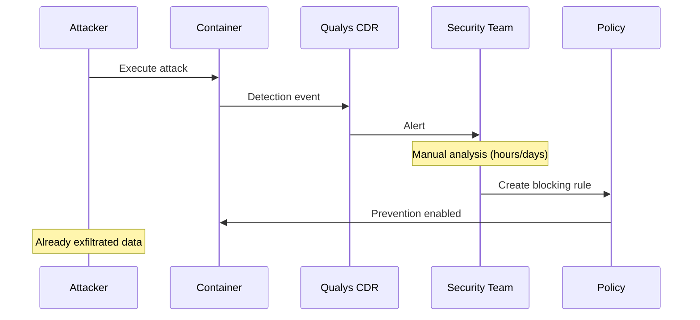

By the time security teams analyze alerts and create policies, attackers have often achieved their objectives.

## The Solution: Automated Policy Generation

This project closes the loop by automatically generating Qualys TracingPolicies from CDR detection events:

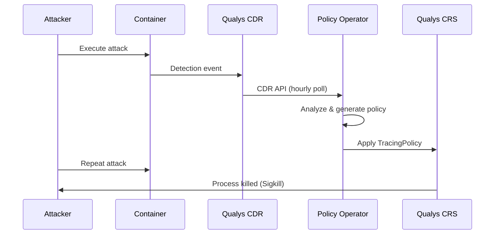

## Architecture Overview

The system consists of three main components working together:

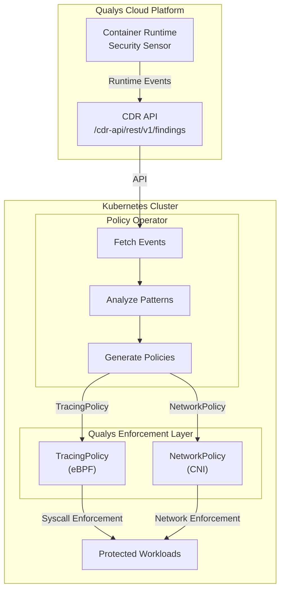

## Threat Categories and Responses

The operator maps CDR threat categories to specific enforcement actions:

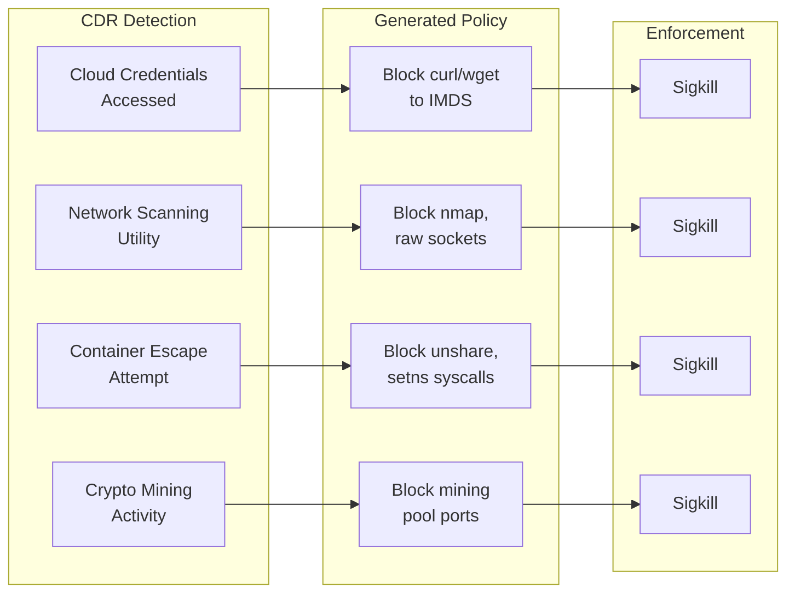

## MITRE ATT&CK Mapping

All generated policies are tagged with MITRE ATT&CK techniques for compliance and reporting:

| CDR Category | MITRE Technique | Enforcement Action |
|--------------|-----------------|-------------------|
| Cloud_Credentials_Accessed_By_Network_Utility | T1552.005 | Block IMDS access |
| Network_Scanning_Utility | T1046 | Block scanning tools |
| Container_Escape | T1611 | Block namespace manipulation |
| Privilege_Escalation | T1548 | Block setuid(0) |
| Crypto_Mining | T1496 | Block mining pool connections |
| Reverse_Shell | T1059.004 | Block shell spawning |

## Deployment Options

### Option 1: Kubernetes CronJob (Recommended)

Run the operator as a scheduled job that periodically syncs policies:

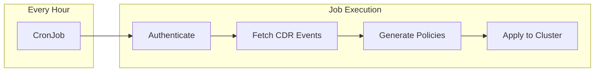

```yaml
apiVersion: batch/v1
kind: CronJob
metadata:
  name: qualys-policy-generator
spec:
  schedule: "0 * * * *"  # Every hour
  jobTemplate:
    spec:
      template:
        spec:
          containers:
          - name: generator
            image: qualys/policy-operator:latest
            args: ["--once", "--hours=24", "--apply"]
            env:
            - name: QUALYS_USERNAME
              valueFrom:
                secretKeyRef:
                  name: qualys-credentials
                  key: username
```

### Option 2: Continuous Controller

Run as a long-running deployment that continuously monitors for new threats:

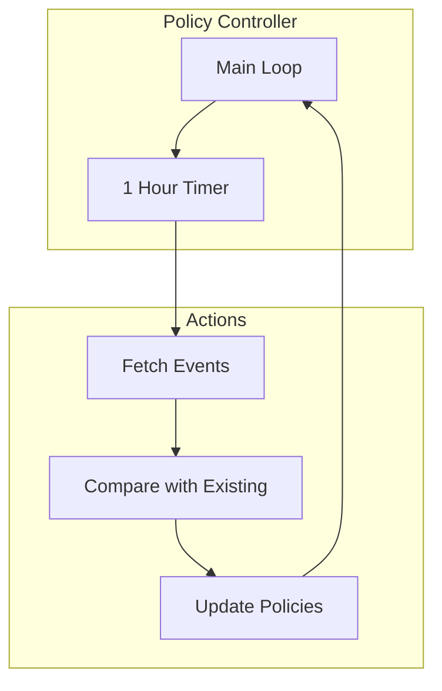

## Policy Lifecycle

Generated policies follow a safe deployment pattern:

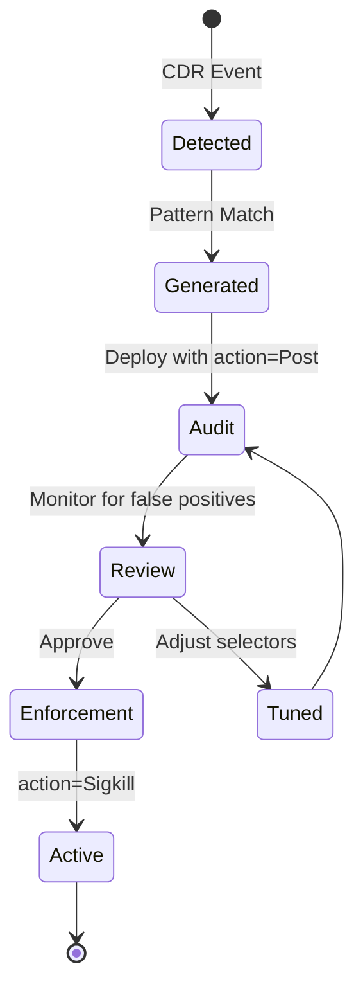

### Audit Mode First

Always deploy new policies in audit mode first:

```yaml
matchActions:
  - action: Post  # Audit mode - log only
```

After validating no false positives occur, switch to enforcement:

```yaml
matchActions:
  - action: Sigkill  # Kill the process
```

## Example: Cloud Credential Theft Prevention

When CDR detects `curl` accessing the cloud metadata endpoint:

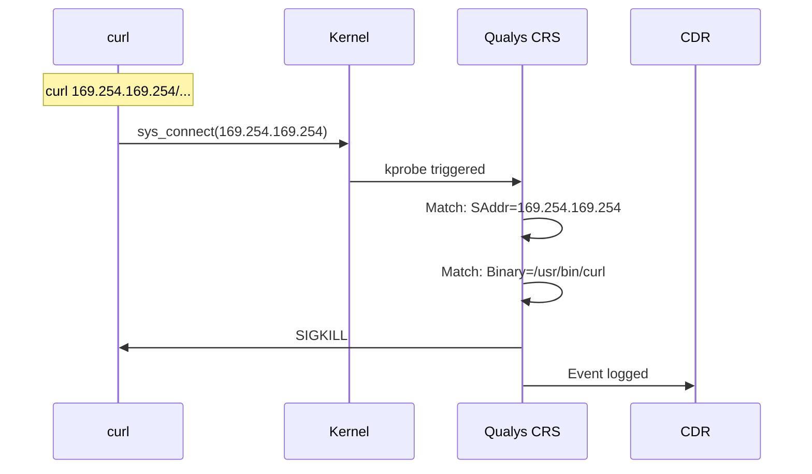

Generated TracingPolicy:

```yaml
apiVersion: cilium.io/v1alpha1
kind: TracingPolicy
metadata:
  name: cdr-block-cloud-creds
  labels:
    mitre.attack/technique: T1552.005
spec:
  kprobes:
    - call: sys_connect
      syscall: true
      args:
        - index: 1
          type: sockaddr
      selectors:
        - matchArgs:
            - index: 1
              operator: SAddr
              values: ["169.254.169.254"]
          matchBinaries:
            - operator: In
              values: ["/usr/bin/curl", "/usr/bin/wget"]
          matchActions:
            - action: Sigkill
```

## Security Considerations

### Credentials Management

Never store credentials in code or ConfigMaps:

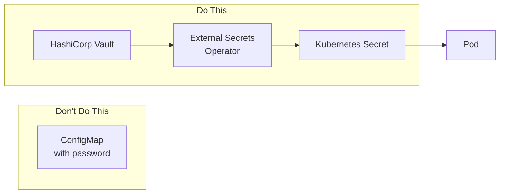

### RBAC Restrictions

The operator only needs permission to manage TracingPolicies:

```yaml
rules:
  - apiGroups: ["cilium.io"]
    resources: ["tracingpolicies"]
    verbs: ["get", "list", "create", "update", "patch"]
```

## Metrics and Observability

Track the effectiveness of your automated response:

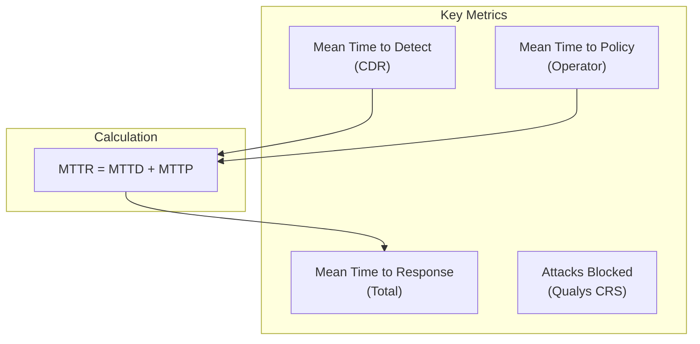

With automated policy generation:
- **MTTD**: Minutes (Qualys CDR)
- **MTTP**: 1 hour (CronJob interval)
- **MTTR**: ~1 hour total

Compare to manual response:
- **MTTR**: Hours to days

## Real-Time Blocking with Webhooks

For sub-second response times, deploy the webhook server to receive CDR events in real-time:

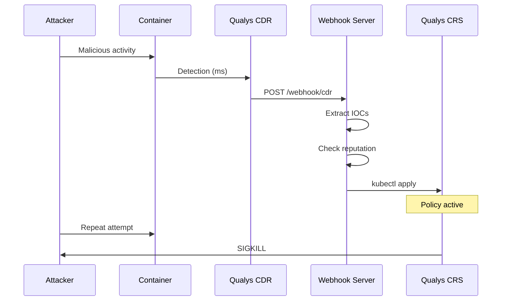

### Webhook Server Architecture

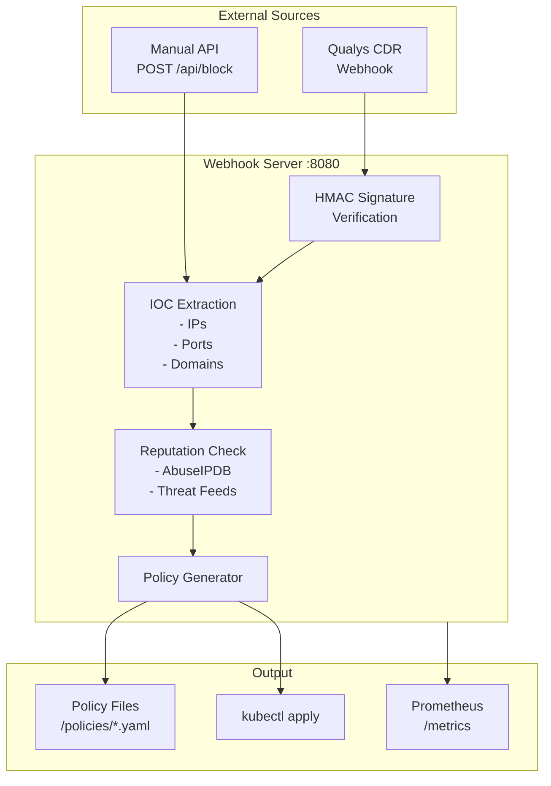

### Webhook Endpoints

| Endpoint | Method | Description |
|----------|--------|-------------|
| `/webhook/cdr` | POST | Receive Qualys CDR events |
| `/api/block` | POST | Manual IP/port blocking |
| `/api/unblock` | POST | Remove blocks |
| `/health` | GET | Health check |
| `/metrics` | GET | Prometheus metrics |
| `/status` | GET | Current block status |

### Manual Blocking API

```bash
# Block specific IPs
curl -X POST http://webhook:8080/api/block \
  -H "Content-Type: application/json" \
  -d '{
    "type": "ip",
    "values": ["1.2.3.4", "5.6.7.8"],
    "reason": "C2 communication detected",
    "action": "Sigkill"
  }'

# Block suspicious ports
curl -X POST http://webhook:8080/api/block \
  -H "Content-Type: application/json" \
  -d '{
    "type": "port",
    "values": ["4444", "6666"],
    "reason": "Reverse shell ports"
  }'

# Check status
curl http://webhook:8080/status
```

### Configuring Qualys Webhook

In Qualys Console:
1. Go to **TotalCloud > Settings > Integrations**
2. Add new **Webhook** integration
3. Set URL: `https://qualys-webhook.example.com/webhook/cdr`
4. Set secret for HMAC signature verification
5. Select event types: Container threats, CDR detections

### Response Time Comparison

```mermaid
gantt
    title Response Time: Polling vs Webhook
    dateFormat X
    axisFormat %s

    section Polling (1hr)
    Detection       :0, 1
    Wait for poll   :1, 3600
    Generate policy :3600, 3610
    Apply           :3610, 3615

    section Webhook
    Detection       :0, 1
    Webhook POST    :1, 2
    Generate policy :2, 3
    Apply           :3, 4
```

| Metric | Polling (1hr) | Webhook |
|--------|---------------|---------|
| Detection to policy | ~60 min | ~3 sec |
| Attack window | Large | Minimal |
| Resource usage | Lower | Higher |
| Reliability | Higher | Depends on uptime |

## Conclusion

Automated threat response transforms container security from reactive to proactive. By connecting Qualys CDR detection to Qualys CRS enforcement through an automated operator, organizations can:

1. **Reduce response time** from hours/days to minutes
2. **Ensure consistency** in policy generation
3. **Scale security** across large container deployments
4. **Maintain compliance** with MITRE ATT&CK tagging

The feedback loop between detection and enforcement creates a self-improving security posture where each detected threat strengthens overall defenses.

## Next Steps

1. Deploy the operator in your cluster
2. Start with audit mode (`--action=Post`)
3. Monitor for false positives
4. Gradually enable enforcement
5. Integrate with your SIEM for alerting

---

*For implementation details, see the [operator documentation](../operator/README.md).*
